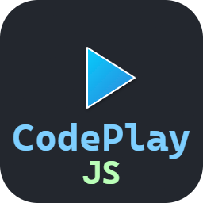

# CodePlayJS

  

  <strong>An interactive development environment for JavaScript and TypeScript</strong>

---

## Description

CodePlayJS is a tool designed for developers looking for a fast and efficient environment to experiment with JavaScript and TypeScript code. It is currently in version 1.0.0 Beta and is available exclusively for Windows.

### Key Features

- **Load, create, and save files**: Compatible with `.js` and `.ts` files.
- **Advanced editor**: Uses the powerful [Monaco Editor](https://microsoft.github.io/monaco-editor/), offering a modern and smooth editing experience.
- **Real-time execution**: Allows you to run code automatically as you type or manually if you prefer more control.
- **Additional sections**:
  - **Global variables**: A dedicated view to display variables in the global scope.
  - **Integrated console**: Displays the results of `console.log` directly in the application.

### Quick Commands

- **Run manually**: `Ctrl + Enter`
- **Open file**: `Ctrl + O`
- **New file**: `Ctrl + N`
- **Save file**: `Ctrl + S`

---

## Downloads

  <a href="https://drive.google.com/file/d/19lyTdRvgc9XkE6ASzhawdvlHjY9SrjvI/view?usp=drive_link" style="text-decoration: none;">
    <button style="padding: 10px 20px; background-color: #4CAF50; color: white; border: none; border-radius: 5px; cursor: pointer;">
      Download Portable Version
    </button>
  </a>
  <a href="https://drive.google.com/file/d/1vIjd3JOoiL7NH1k4LQMSTVBPGXVw-p9m/view?usp=drive_link" style="text-decoration: none;">
    <button style="padding: 10px 20px; background-color: #2196F3; color: white; border: none; border-radius: 5px; cursor: pointer;">
      Download Installer (.exe)
    </button>
  </a>

